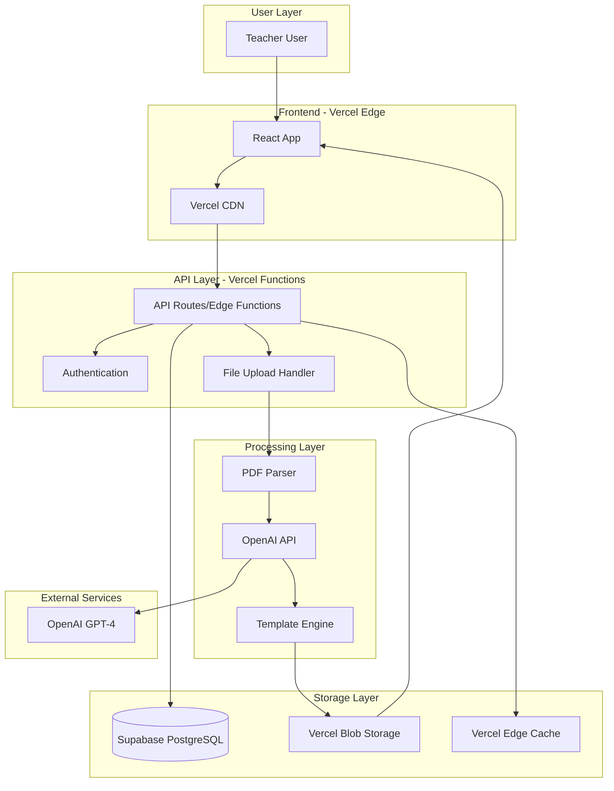
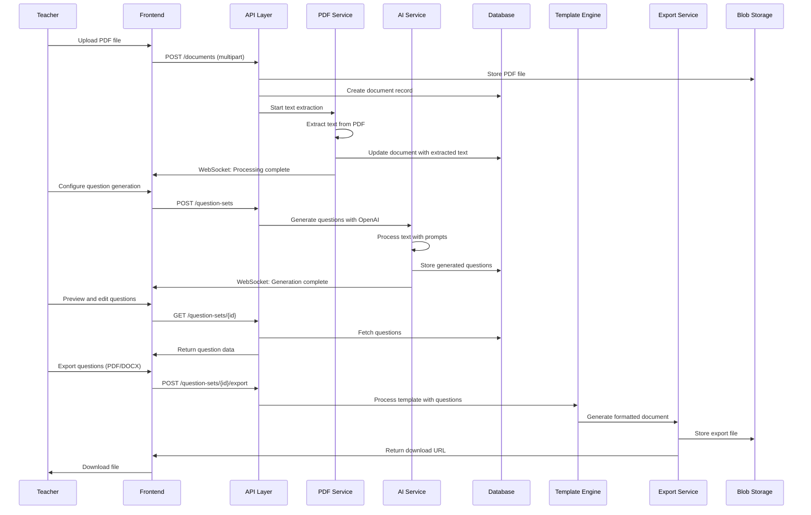

# AI Question Generator - Architecture Overview

## Introduction

This document outlines the complete fullstack architecture for **AI Question Generator**, including backend systems, frontend implementation, and their integration. It serves as the single source of truth for AI-driven development, ensuring consistency across the entire technology stack.

This unified approach combines what would traditionally be separate backend and frontend architecture documents, streamlining the development process for modern fullstack applications where these concerns are increasingly intertwined.

### Starter Template or Existing Project

**N/A - Greenfield project** - The PRD specifies React frontend and mentions no existing codebase or starter templates. This is a clean slate implementation.

### Change Log

| Date | Version | Description | Author |
|------|---------|-------------|---------|
| [Current Date] | 1.0 | Initial architecture creation | Winston (Architect) |

## High Level Architecture

### Technical Summary

The AI Question Generator employs a **modern React application with serverless backend functions** deployed on Vercel, featuring a React frontend for optimal performance and user experience. The system integrates OpenAI's API for intelligent question generation and uses a lightweight SQLite database for session management. The architecture prioritizes rapid development through a monorepo structure while maintaining scalability through edge computing and CDN distribution.

### Platform and Infrastructure Choice

**Platform:** Vercel + Supabase  
**Key Services:** Vercel Edge Functions, Supabase Database, Vercel Blob Storage, OpenAI API  
**Deployment Host and Regions:** Vercel Global Edge Network (US, EU, Asia)

### Repository Structure

**Structure:** Monorepo with Turborepo  
**Monorepo Tool:** Turborepo  
**Package Organization:** Apps (web, api) + Packages (shared, ui, config)

### High Level Architecture Diagram



### Architectural Patterns

- **Jamstack Architecture:** Static site generation with serverless APIs - _Rationale:_ Optimal performance and scalability for content-heavy applications with fast global delivery
- **Component-Based UI:** Reusable React components with TypeScript - _Rationale:_ Maintainability and type safety across large codebases, essential for rapid development
- **Repository Pattern:** Abstract data access logic - _Rationale:_ Enables testing and future database migration flexibility while keeping business logic clean
- **API Gateway Pattern:** Single entry point for all API calls - _Rationale:_ Centralized auth, rate limiting, and monitoring through Vercel's built-in capabilities
- **Event-Driven Processing:** Async file processing with status updates - _Rationale:_ Handles AI processing delays gracefully while providing user feedback
- **Template Engine Pattern:** Pluggable template system with Markdown support - _Rationale:_ Enables Super Admin customization and maintains separation of concerns

## Core Workflows

### Primary User Workflow: PDF Upload to Question Export



## Unified Project Structure

### Monorepo Structure

```
ai-question-generator/
├── .github/                    # CI/CD workflows
├── apps/                       # Application packages
│   └── web/                    # Frontend application (React)
├── packages/                   # Shared packages
│   ├── shared/                 # Shared types/utilities
│   ├── ui/                     # Shared UI components
│   └── config/                 # Shared configuration
├── infrastructure/             # IaC definitions
├── scripts/                    # Build/deploy scripts
├── docs/                       # Documentation
├── .env.example                # Environment template
├── package.json                # Root package.json
├── turbo.json                  # Turborepo configuration
└── README.md
```

### Environment Configuration

```bash
# Required Environment Variables
VITE_SUPABASE_URL=https://your-project.supabase.co
VITE_SUPABASE_ANON_KEY=your_supabase_anon_key
SUPABASE_SERVICE_ROLE_KEY=your_supabase_service_role_key
OPENAI_API_KEY=your_openai_api_key
MAX_FILE_SIZE=10485760  # 10MB
ALLOWED_FILE_TYPES=application/pdf
DEFAULT_QUESTION_COUNT=10
MAX_QUESTION_COUNT=50
```

## Conclusion

This architecture provides a solid foundation for the AI Question Generator POC, focusing on rapid development while maintaining quality and scalability. The unified approach ensures consistency across the entire technology stack and provides clear guidance for AI-driven development.

The architecture is ready for implementation and can be extended as the application grows beyond the POC phase.
