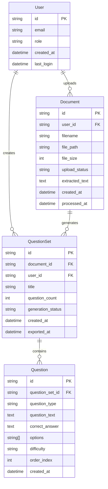

# AI Question Generator - Tech Stack & Data Models

## Tech Stack

| Category | Technology | Version | Purpose | Rationale |
|----------|------------|---------|---------|-----------|
| Frontend Language | TypeScript | 5.3+ | Type-safe development | Essential for rapid development with fewer runtime errors |
| Frontend Framework | React | 18.0+ | Modern React with hooks and functional components | Optimal performance, excellent developer experience, Vercel integration |
| UI Component Library | Material-UI (MUI) | 5.15+ | Complete component system | Professional design system, excellent accessibility, rapid development |
| State Management | Zustand | 4.4+ | Lightweight state management | Simple, TypeScript-friendly, perfect for this scope |
| Backend Language | TypeScript | 5.3+ | Unified language across stack | Shared types, reduced context switching |
| Backend Framework | Vercel Functions | 1.0+ | Serverless functions | Leverages Vercel's edge functions, excellent performance |
| API Style | REST | - | Simple HTTP API | Straightforward for PDF upload and question generation |
| Database | Supabase PostgreSQL | 15+ | Primary data store | Real-time capabilities, built-in auth, excellent TypeScript support |
| Cache | Vercel Edge Cache | - | CDN and edge caching | Built-in performance optimization |
| File Storage | Vercel Blob Storage | - | Temporary file storage | Integrated with Vercel, automatic cleanup |
| Authentication | Supabase Auth | 2.0+ | User management | Built-in auth with JWT, supports teacher role |
| Frontend Testing | Vitest + Testing Library | 1.0+ / 14.0+ | Unit and integration tests | Fast, modern testing with excellent React support |
| Backend Testing | Vitest + Supertest | 1.0+ / 6.3+ | API testing | Unified testing framework across stack |
| E2E Testing | Playwright | 1.40+ | End-to-end testing | Reliable, fast, excellent debugging |
| Build Tool | Turborepo | 1.10+ | Monorepo build system | Fast, incremental builds, optimal for monorepos |
| Bundler | Vite | 5.0+ | Fast build tool | Optimized for React, faster than Webpack |
| IaC Tool | Vercel CLI | 32.0+ | Infrastructure as Code | Native Vercel deployment and configuration |
| CI/CD | GitHub Actions | - | Automated testing and deployment | Free, integrated with GitHub, excellent Vercel integration |
| Monitoring | Vercel Analytics | - | Performance monitoring | Built-in, zero-config monitoring |
| Logging | Vercel Functions Logs | - | Application logging | Integrated logging with Vercel platform |

## Data Models

### User Model

**Purpose:** Represents teachers who use the system.

**Key Attributes:**
- id: string - Unique identifier (UUID)
- email: string - User's email address for authentication
- role: 'teacher' - User role (simplified for POC)
- created_at: Date - Account creation timestamp
- last_login: Date - Most recent login timestamp

**TypeScript Interface:**
```typescript
interface User {
  id: string;
  email: string;
  role: 'teacher';
  created_at: Date;
  last_login: Date;
}
```

### Document Model

**Purpose:** Represents uploaded PDF curriculum documents that serve as input for question generation.

**Key Attributes:**
- id: string - Unique identifier (UUID)
- user_id: string - Foreign key to User
- filename: string - Original filename of uploaded PDF
- file_path: string - Storage path in Vercel Blob Storage
- file_size: number - File size in bytes
- upload_status: 'uploading' | 'processing' | 'completed' | 'failed' - Processing status
- extracted_text: string - Text content extracted from PDF
- created_at: Date - Upload timestamp
- processed_at: Date - When text extraction completed

**TypeScript Interface:**
```typescript
interface Document {
  id: string;
  user_id: string;
  filename: string;
  file_path: string;
  file_size: number;
  upload_status: 'uploading' | 'processing' | 'completed' | 'failed';
  extracted_text?: string;
  created_at: Date;
  processed_at?: Date;
}
```

### QuestionSet Model

**Purpose:** Represents a collection of generated questions from a document.

**Key Attributes:**
- id: string - Unique identifier (UUID)
- document_id: string - Foreign key to Document
- user_id: string - Foreign key to User
- title: string - User-defined title for the question set
- question_count: number - Total number of questions generated
- generation_status: 'generating' | 'completed' | 'failed' - AI generation status
- created_at: Date - Generation timestamp
- exported_at: Date - When last exported (if any)

**TypeScript Interface:**
```typescript
interface QuestionSet {
  id: string;
  document_id: string;
  user_id: string;
  title: string;
  question_count: number;
  generation_status: 'generating' | 'completed' | 'failed';
  created_at: Date;
  exported_at?: Date;
}
```

### Question Model

**Purpose:** Represents individual questions generated by AI.

**Key Attributes:**
- id: string - Unique identifier (UUID)
- question_set_id: string - Foreign key to QuestionSet
- question_type: 'multiple_choice' | 'short_answer' | 'true_false' - Type of question
- question_text: string - The question content
- correct_answer: string - The correct answer
- options: string[] - Answer choices (for multiple choice)
- difficulty: 'easy' | 'medium' | 'hard' - AI-assessed difficulty level
- order_index: number - Position within the question set
- created_at: Date - Generation timestamp

**TypeScript Interface:**
```typescript
interface Question {
  id: string;
  question_set_id: string;
  question_type: 'multiple_choice' | 'short_answer' | 'true_false';
  question_text: string;
  correct_answer: string;
  options: string[];
  difficulty: 'easy' | 'medium' | 'hard';
  order_index: number;
  created_at: Date;
}
```

## Data Relationships

### Entity Relationship Diagram



## Data Validation and Constraints

### Database Constraints
- **Primary Keys:** All entities use UUID primary keys
- **Foreign Keys:** Proper referential integrity with CASCADE deletes
- **Check Constraints:** Enum values for status fields and question types
- **Unique Constraints:** Email uniqueness for users
- **Not Null Constraints:** Required fields marked as NOT NULL

### Application-Level Validation
- **File Size:** Maximum 10MB for PDF uploads
- **File Type:** Only PDF files allowed
- **Question Count:** 1-50 questions per set
- **Text Length:** Minimum 100 characters for extracted text
- **Email Format:** Valid email format validation

### Data Integrity Rules
- **User Deletion:** Cascade delete all user data
- **Document Deletion:** Cascade delete associated question sets
- **Question Set Deletion:** Cascade delete associated questions
- **Status Transitions:** Enforce valid status transitions
- **Order Index:** Maintain sequential ordering within question sets
