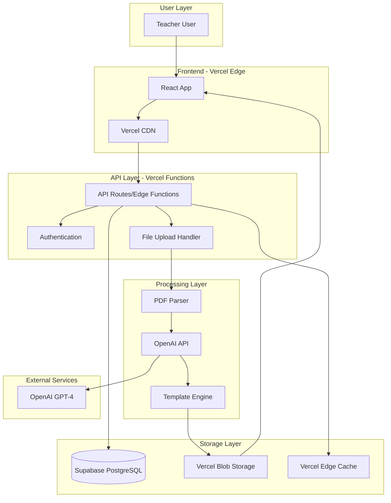
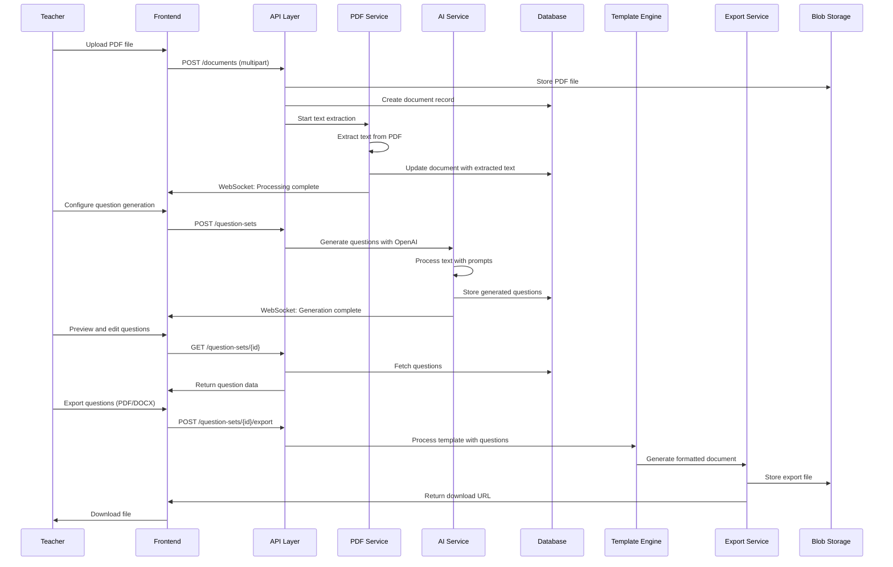

# AI Question Generator Fullstack Architecture Document

## Introduction

This document outlines the complete fullstack architecture for **AI Question Generator**, including backend systems, frontend implementation, and their integration. It serves as the single source of truth for AI-driven development, ensuring consistency across the entire technology stack.

This unified approach combines what would traditionally be separate backend and frontend architecture documents, streamlining the development process for modern fullstack applications where these concerns are increasingly intertwined.

### Starter Template or Existing Project

**N/A - Greenfield project** - The PRD specifies React frontend and mentions no existing codebase or starter templates. This is a clean slate implementation.

### Change Log

| Date | Version | Description | Author |
|------|---------|-------------|---------|
| [Current Date] | 1.0 | Initial architecture creation | Winston (Architect) |

## High Level Architecture

### Technical Summary

The AI Question Generator employs a **modern React application with serverless backend functions** deployed on Vercel, featuring a React frontend for optimal performance and user experience. The system integrates OpenAI's API for intelligent question generation and uses a lightweight SQLite database for session management. The architecture prioritizes rapid development through a monorepo structure while maintaining scalability through edge computing and CDN distribution.

### Platform and Infrastructure Choice

**Platform:** Vercel + Supabase  
**Key Services:** Vercel Edge Functions, Supabase Database, Vercel Blob Storage, OpenAI API  
**Deployment Host and Regions:** Vercel Global Edge Network (US, EU, Asia)

### Repository Structure

**Structure:** Monorepo with Turborepo  
**Monorepo Tool:** Turborepo  
**Package Organization:** Apps (web, api) + Packages (shared, ui, config)

### High Level Architecture Diagram



### Architectural Patterns

- **Jamstack Architecture:** Static site generation with serverless APIs - _Rationale:_ Optimal performance and scalability for content-heavy applications with fast global delivery
- **Component-Based UI:** Reusable React components with TypeScript - _Rationale:_ Maintainability and type safety across large codebases, essential for rapid development
- **Repository Pattern:** Abstract data access logic - _Rationale:_ Enables testing and future database migration flexibility while keeping business logic clean
- **API Gateway Pattern:** Single entry point for all API calls - _Rationale:_ Centralized auth, rate limiting, and monitoring through Vercel's built-in capabilities
- **Event-Driven Processing:** Async file processing with status updates - _Rationale:_ Handles AI processing delays gracefully while providing user feedback
- **Template Engine Pattern:** Pluggable template system with Markdown support - _Rationale:_ Enables Super Admin customization and maintains separation of concerns

## Tech Stack

| Category | Technology | Version | Purpose | Rationale |
|----------|------------|---------|---------|-----------|
| Frontend Language | TypeScript | 5.3+ | Type-safe development | Essential for rapid development with fewer runtime errors |
| Frontend Framework | React | 18.0+ | Modern React with hooks and functional components | Optimal performance, excellent developer experience, Vercel integration |
| UI Component Library | Material-UI (MUI) | 5.15+ | Complete component system | Professional design system, excellent accessibility, rapid development |
| State Management | Zustand | 4.4+ | Lightweight state management | Simple, TypeScript-friendly, perfect for this scope |
| Backend Language | TypeScript | 5.3+ | Unified language across stack | Shared types, reduced context switching |
| Backend Framework | Vercel Functions | 1.0+ | Serverless functions | Leverages Vercel's edge functions, excellent performance |
| API Style | REST | - | Simple HTTP API | Straightforward for PDF upload and question generation |
| Database | Supabase PostgreSQL | 15+ | Primary data store | Real-time capabilities, built-in auth, excellent TypeScript support |
| Cache | Vercel Edge Cache | - | CDN and edge caching | Built-in performance optimization |
| File Storage | Vercel Blob Storage | - | Temporary file storage | Integrated with Vercel, automatic cleanup |
| Authentication | Supabase Auth | 2.0+ | User management | Built-in auth with JWT, supports teacher role |
| Frontend Testing | Vitest + Testing Library | 1.0+ / 14.0+ | Unit and integration tests | Fast, modern testing with excellent React support |
| Backend Testing | Vitest + Supertest | 1.0+ / 6.3+ | API testing | Unified testing framework across stack |
| E2E Testing | Playwright | 1.40+ | End-to-end testing | Reliable, fast, excellent debugging |
| Build Tool | Turborepo | 1.10+ | Monorepo build system | Fast, incremental builds, optimal for monorepos |
| Bundler | Vite | 5.0+ | Fast build tool | Optimized for React, faster than Webpack |
| IaC Tool | Vercel CLI | 32.0+ | Infrastructure as Code | Native Vercel deployment and configuration |
| CI/CD | GitHub Actions | - | Automated testing and deployment | Free, integrated with GitHub, excellent Vercel integration |
| Monitoring | Vercel Analytics | - | Performance monitoring | Built-in, zero-config monitoring |
| Logging | Vercel Functions Logs | - | Application logging | Integrated logging with Vercel platform |

## Data Models

### User Model

**Purpose:** Represents teachers who use the system.

**Key Attributes:**
- id: string - Unique identifier (UUID)
- email: string - User's email address for authentication
- role: 'teacher' - User role (simplified for POC)
- created_at: Date - Account creation timestamp
- last_login: Date - Most recent login timestamp

**TypeScript Interface:**
```typescript
interface User {
  id: string;
  email: string;
  role: 'teacher';
  created_at: Date;
  last_login: Date;
}
```

### Document Model

**Purpose:** Represents uploaded PDF curriculum documents that serve as input for question generation.

**Key Attributes:**
- id: string - Unique identifier (UUID)
- user_id: string - Foreign key to User
- filename: string - Original filename of uploaded PDF
- file_path: string - Storage path in Vercel Blob Storage
- file_size: number - File size in bytes
- upload_status: 'uploading' | 'processing' | 'completed' | 'failed' - Processing status
- extracted_text: string - Text content extracted from PDF
- created_at: Date - Upload timestamp
- processed_at: Date - When text extraction completed

### QuestionSet Model

**Purpose:** Represents a collection of generated questions from a document.

**Key Attributes:**
- id: string - Unique identifier (UUID)
- document_id: string - Foreign key to Document
- user_id: string - Foreign key to User
- title: string - User-defined title for the question set
- question_count: number - Total number of questions generated
- generation_status: 'generating' | 'completed' | 'failed' - AI generation status
- created_at: Date - Generation timestamp
- exported_at: Date - When last exported (if any)

### Question Model

**Purpose:** Represents individual questions generated by AI.

**Key Attributes:**
- id: string - Unique identifier (UUID)
- question_set_id: string - Foreign key to QuestionSet
- question_type: 'multiple_choice' | 'short_answer' | 'true_false' - Type of question
- question_text: string - The question content
- correct_answer: string - The correct answer
- options: string[] - Answer choices (for multiple choice)
- difficulty: 'easy' | 'medium' | 'hard' - AI-assessed difficulty level
- order_index: number - Position within the question set
- created_at: Date - Generation timestamp

## API Specification

### REST API Endpoints

**Authentication:**
- `POST /api/auth/login` - Teacher login
- `POST /api/auth/logout` - Teacher logout

**Documents:**
- `POST /api/documents` - Upload PDF document
- `GET /api/documents` - Get user's documents
- `GET /api/documents/{id}` - Get document details
- `DELETE /api/documents/{id}` - Delete document
- `POST /api/documents/{id}/process` - Start document processing

**Question Sets:**
- `POST /api/question-sets` - Generate questions from document
- `GET /api/question-sets` - Get user's question sets
- `GET /api/question-sets/{id}` - Get question set with questions
- `DELETE /api/question-sets/{id}` - Delete question set
- `POST /api/question-sets/{id}/export` - Export question set

**Health:**
- `GET /api/health` - Health check endpoint

## Components

### Frontend Components

**React App Component**
- **Responsibility:** Main application shell with routing, authentication state, and global error handling
- **Technology Stack:** React 18, TypeScript, MUI v5

**File Upload Component**
- **Responsibility:** Handle PDF file uploads with drag-and-drop, validation, and progress tracking
- **Technology Stack:** MUI Upload components, React Dropzone, TypeScript

**Document Processing Status Component**
- **Responsibility:** Display real-time processing status and extracted text preview
- **Technology Stack:** MUI Progress components, Zustand state management

**Question Generation Component**
- **Responsibility:** Configure and trigger AI question generation with basic settings
- **Technology Stack:** MUI Form components, TypeScript interfaces

**Question Preview Component**
- **Responsibility:** Display generated questions with basic editing and export options
- **Technology Stack:** MUI DataGrid, Rich text editor

### Backend Components

**Authentication Service**
- **Responsibility:** Handle teacher authentication and session management
- **Technology Stack:** Vercel Functions, Supabase Auth SDK, TypeScript

**File Processing Service**
- **Responsibility:** Handle PDF upload, text extraction, and file storage management
- **Technology Stack:** Node.js, pdf-parse, Vercel Blob SDK

**AI Question Generation Service**
- **Responsibility:** Integrate with OpenAI API to generate questions from extracted text
- **Technology Stack:** OpenAI SDK, TypeScript, prompt engineering

**Template Engine Service**
- **Responsibility:** Process predefined templates with placeholders and generate formatted output
- **Technology Stack:** Markdown-it, docx library, PDF generation

**Database Service**
- **Responsibility:** Handle all database operations with type safety and connection management
- **Technology Stack:** Supabase client, TypeScript, SQL

**Export Service**
- **Responsibility:** Generate downloadable files in various formats with proper formatting
- **Technology Stack:** jsPDF, docx library, Vercel Blob Storage

## External APIs

### OpenAI API

- **Purpose:** Generate high-quality assessment questions from curriculum content using AI
- **Documentation:** https://platform.openai.com/docs/api-reference
- **Base URL(s):** https://api.openai.com/v1
- **Authentication:** Bearer token (API key)
- **Rate Limits:** 3,500 requests per minute for GPT-4, 10,000 tokens per minute

**Key Endpoints Used:**
- `POST /chat/completions` - Generate questions using GPT-4 with structured prompts

### Supabase API

- **Purpose:** Database operations, authentication, and real-time updates
- **Documentation:** https://supabase.com/docs/reference
- **Base URL(s):** https://[project-ref].supabase.co
- **Authentication:** JWT token via Supabase Auth
- **Rate Limits:** 500 requests per second for database operations

### Vercel Blob Storage API

- **Purpose:** Temporary file storage for uploaded PDFs and generated exports
- **Documentation:** https://vercel.com/docs/storage/vercel-blob
- **Base URL(s):** https://blob.vercel-storage.com
- **Authentication:** Vercel API token
- **Rate Limits:** 1000 requests per minute

## Core Workflows

### Primary User Workflow: PDF Upload to Question Export



## Database Schema

### PostgreSQL Schema

```sql
-- Enable UUID extension
CREATE EXTENSION IF NOT EXISTS "uuid-ossp";

-- Users table (simplified for POC - teachers only)
CREATE TABLE users (
    id UUID PRIMARY KEY DEFAULT uuid_generate_v4(),
    email VARCHAR(255) UNIQUE NOT NULL,
    role VARCHAR(20) DEFAULT 'teacher' CHECK (role = 'teacher'),
    created_at TIMESTAMP WITH TIME ZONE DEFAULT NOW(),
    last_login TIMESTAMP WITH TIME ZONE
);

-- Documents table
CREATE TABLE documents (
    id UUID PRIMARY KEY DEFAULT uuid_generate_v4(),
    user_id UUID NOT NULL REFERENCES users(id) ON DELETE CASCADE,
    filename VARCHAR(255) NOT NULL,
    file_path TEXT NOT NULL,
    file_size INTEGER NOT NULL,
    upload_status VARCHAR(20) NOT NULL DEFAULT 'uploading' 
        CHECK (upload_status IN ('uploading', 'processing', 'completed', 'failed')),
    extracted_text TEXT,
    created_at TIMESTAMP WITH TIME ZONE DEFAULT NOW(),
    processed_at TIMESTAMP WITH TIME ZONE
);

-- Question sets table
CREATE TABLE question_sets (
    id UUID PRIMARY KEY DEFAULT uuid_generate_v4(),
    document_id UUID NOT NULL REFERENCES documents(id) ON DELETE CASCADE,
    user_id UUID NOT NULL REFERENCES users(id) ON DELETE CASCADE,
    title VARCHAR(255) NOT NULL,
    question_count INTEGER NOT NULL DEFAULT 0,
    generation_status VARCHAR(20) NOT NULL DEFAULT 'generating'
        CHECK (generation_status IN ('generating', 'completed', 'failed')),
    created_at TIMESTAMP WITH TIME ZONE DEFAULT NOW(),
    exported_at TIMESTAMP WITH TIME ZONE
);

-- Questions table
CREATE TABLE questions (
    id UUID PRIMARY KEY DEFAULT uuid_generate_v4(),
    question_set_id UUID NOT NULL REFERENCES question_sets(id) ON DELETE CASCADE,
    question_type VARCHAR(20) NOT NULL 
        CHECK (question_type IN ('multiple_choice', 'short_answer', 'true_false')),
    question_text TEXT NOT NULL,
    correct_answer TEXT NOT NULL,
    options TEXT[] DEFAULT '{}', -- Array for multiple choice options
    difficulty VARCHAR(10) NOT NULL DEFAULT 'medium'
        CHECK (difficulty IN ('easy', 'medium', 'hard')),
    order_index INTEGER NOT NULL DEFAULT 0,
    created_at TIMESTAMP WITH TIME ZONE DEFAULT NOW()
);

-- Indexes for performance
CREATE INDEX idx_documents_user_id ON documents(user_id);
CREATE INDEX idx_documents_upload_status ON documents(upload_status);
CREATE INDEX idx_question_sets_user_id ON question_sets(user_id);
CREATE INDEX idx_question_sets_document_id ON question_sets(document_id);
CREATE INDEX idx_questions_question_set_id ON questions(question_set_id);
CREATE INDEX idx_questions_order_index ON questions(question_set_id, order_index);

-- Row Level Security (RLS) policies
ALTER TABLE users ENABLE ROW LEVEL SECURITY;
ALTER TABLE documents ENABLE ROW LEVEL SECURITY;
ALTER TABLE question_sets ENABLE ROW LEVEL SECURITY;
ALTER TABLE questions ENABLE ROW LEVEL SECURITY;

-- Users can only see their own data
CREATE POLICY "Users can view own profile" ON users
    FOR SELECT USING (auth.uid() = id);

-- Documents policies
CREATE POLICY "Users can view own documents" ON documents
    FOR SELECT USING (auth.uid() = user_id);

CREATE POLICY "Users can insert own documents" ON documents
    FOR INSERT WITH CHECK (auth.uid() = user_id);

-- Question sets policies
CREATE POLICY "Users can view own question sets" ON question_sets
    FOR SELECT USING (auth.uid() = user_id);

CREATE POLICY "Users can insert own question sets" ON question_sets
    FOR INSERT WITH CHECK (auth.uid() = user_id);

-- Questions policies (inherited through question_sets)
CREATE POLICY "Users can view questions from own question sets" ON questions
    FOR SELECT USING (
        EXISTS (
            SELECT 1 FROM question_sets 
            WHERE question_sets.id = questions.question_set_id 
            AND question_sets.user_id = auth.uid()
        )
    );
```

## Frontend Architecture

### Component Organization

```
apps/web/src/
├── components/
│   ├── ui/                    # Reusable UI components
│   ├── features/              # Feature-specific components
│   │   ├── upload/
│   │   ├── processing/
│   │   ├── questions/
│   │   └── export/
│   └── layout/                # Layout components
├── pages/                     # React pages
│   ├── index.tsx             # Upload page
│   ├── processing/[id].tsx   # Processing status
│   ├── questions/[id].tsx    # Question preview
│   └── export/[id].tsx       # Export page
├── hooks/                     # Custom React hooks
├── services/                  # API client services
├── stores/                    # Zustand state management
├── types/                     # TypeScript type definitions
└── utils/                     # Utility functions
```

### State Management

**Zustand stores for different features:**
- AuthStore: User authentication state
- UploadStore: File upload progress and status
- QuestionStore: Question generation and editing state

### Routing Architecture

```
/                           # Landing/Upload page
├── processing/[id]         # Document processing status
├── questions/[id]          # Question preview and editing
├── export/[id]             # Export options and download
└── auth/
    ├── login               # Teacher login
    └── register            # Teacher registration
```

## Backend Architecture

### Service Architecture

**Serverless Architecture (Vercel Functions)**

**Function Organization:**
```
apps/web/src/api/
├── auth/
│   ├── login.ts
│   └── logout.ts
├── documents/
│   ├── index.ts          # GET, POST /api/documents
│   ├── [id].ts          # GET, DELETE /api/documents/[id]
│   └── [id]/process.ts  # POST /api/documents/[id]/process
├── question-sets/
│   ├── index.ts         # GET, POST /api/question-sets
│   ├── [id].ts         # GET, DELETE /api/question-sets/[id]
│   └── [id]/export.ts  # POST /api/question-sets/[id]/export
└── health.ts
```

### Authentication and Authorization

**Auth Flow:**
- JWT token-based authentication via Supabase Auth
- Row Level Security (RLS) policies for data isolation
- Teacher role-based access control

## Unified Project Structure

### Monorepo Structure

```
ai-question-generator/
├── .github/                    # CI/CD workflows
├── apps/                       # Application packages
│   └── web/                    # Frontend application (React)
├── packages/                   # Shared packages
│   ├── shared/                 # Shared types/utilities
│   ├── ui/                     # Shared UI components
│   └── config/                 # Shared configuration
├── infrastructure/             # IaC definitions
├── scripts/                    # Build/deploy scripts
├── docs/                       # Documentation
├── .env.example                # Environment template
├── package.json                # Root package.json
├── turbo.json                  # Turborepo configuration
└── README.md
```

### Environment Configuration

```bash
# Required Environment Variables
VITE_SUPABASE_URL=https://your-project.supabase.co
VITE_SUPABASE_ANON_KEY=your_supabase_anon_key
SUPABASE_SERVICE_ROLE_KEY=your_supabase_service_role_key
OPENAI_API_KEY=your_openai_api_key
MAX_FILE_SIZE=10485760  # 10MB
ALLOWED_FILE_TYPES=application/pdf
DEFAULT_QUESTION_COUNT=10
MAX_QUESTION_COUNT=50
```

## Development Workflow

### Local Development Setup

**Prerequisites:**
- Node.js >= 18.0.0
- npm >= 9.0.0
- Git >= 2.30.0

**Initial Setup:**
```bash
# Clone repository
git clone https://github.com/your-org/ai-question-generator.git
cd ai-question-generator

# Install dependencies
npm install

# Copy environment files
cp .env.example .env.local

# Start development servers
npm run dev
```

**Development Commands:**
```bash
# Start all services (frontend + backend)
npm run dev

# Run tests
npm run test

# Run linting
npm run lint

# Build all packages
npm run build
```

## Deployment Architecture

### Deployment Strategy

**Frontend Deployment:**
- **Platform:** Vercel
- **Build Command:** `npm run build`
- **Output Directory:** `dist`
- **CDN/Edge:** Vercel Global Edge Network

**Backend Deployment:**
- **Platform:** Vercel Functions
- **Build Command:** `npm run build`
- **Deployment Method:** Serverless Functions (Edge Runtime)

### Environments

| Environment | Frontend URL | Backend URL | Purpose |
|-------------|--------------|-------------|---------|
| Development | http://localhost:5173 | http://localhost:5173/api | Local development |
| Preview | https://ai-qg-git-feature.vercel.app | https://ai-qg-git-feature.vercel.app/api | Feature branch testing |
| Production | https://ai-question-generator.vercel.app | https://ai-question-generator.vercel.app/api | Live environment |

## Security and Performance

### Security Requirements

**Frontend Security:**
- CSP Headers: `default-src 'self'; script-src 'self' 'unsafe-inline' 'unsafe-eval'; style-src 'self' 'unsafe-inline'; img-src 'self' data: https:; connect-src 'self' https://*.supabase.co https://api.openai.com`
- XSS Prevention: React's built-in XSS protection, input sanitization, and Content Security Policy
- Secure Storage: JWT tokens in httpOnly cookies, sensitive data in sessionStorage only

**Backend Security:**
- Input Validation: Comprehensive validation using Zod schemas for all API endpoints
- Rate Limiting: 100 requests per minute per IP, 10 file uploads per hour per user
- CORS Policy: `origin: ['https://ai-question-generator.vercel.app'], credentials: true`

**Authentication Security:**
- Token Storage: JWT tokens in httpOnly cookies with secure and sameSite flags
- Session Management: 24-hour token expiration with automatic refresh
- Password Policy: Minimum 8 characters, mixed case, numbers, and special characters

### Performance Optimization

**Frontend Performance:**
- Bundle Size Target: < 500KB initial bundle, < 1MB total with lazy loading
- Loading Strategy: Code splitting by route, lazy loading for heavy components
- Caching Strategy: Service worker for static assets, React Query for API data caching

**Backend Performance:**
- Response Time Target: < 200ms for API responses, < 30s for AI generation
- Database Optimization: Proper indexing, connection pooling, query optimization
- Caching Strategy: Redis for session data, Vercel Edge Cache for static content

## Testing Strategy

### Testing Pyramid

```
E2E Tests (Playwright)
/        \
Integration Tests (Vitest + Testing Library)
/            \
Frontend Unit  Backend Unit (Vitest + Supertest)
```

### Test Organization

**Frontend Tests:**
- Unit tests for components, hooks, and services
- Integration tests for user workflows
- E2E tests for critical user journeys

**Backend Tests:**
- Unit tests for API endpoints and business logic
- Integration tests for database operations
- E2E tests for complete API workflows

## Coding Standards

### Critical Fullstack Rules

- **Type Sharing:** Always define types in packages/shared and import from there
- **API Calls:** Never make direct HTTP calls - use the service layer for all API communication
- **Environment Variables:** Access only through config objects, never process.env directly
- **Error Handling:** All API routes must use the standard error handler
- **State Updates:** Never mutate state directly - use proper state management patterns with Zustand
- **File Validation:** Always validate file type and size before processing
- **Authentication:** Check user authentication on every protected route
- **Database Queries:** Use Supabase client methods, never raw SQL
- **Component Props:** Always define TypeScript interfaces for component props
- **Async Operations:** Handle all async operations with proper error handling and loading states

### Naming Conventions

| Element | Frontend | Backend | Example |
|---------|----------|---------|---------|
| Components | PascalCase | - | `FileUpload.tsx` |
| Hooks | camelCase with 'use' | - | `useFileUpload.ts` |
| API Routes | - | kebab-case | `/api/question-sets` |
| Database Tables | - | snake_case | `question_sets` |
| Functions | camelCase | camelCase | `generateQuestions()` |
| Constants | UPPER_SNAKE_CASE | UPPER_SNAKE_CASE | `MAX_FILE_SIZE` |
| Types/Interfaces | PascalCase | PascalCase | `QuestionSet` |

## Error Handling Strategy

### Error Response Format

```typescript
interface ApiError {
  error: {
    code: string;
    message: string;
    details?: Record<string, any>;
    timestamp: string;
    requestId: string;
  };
}
```

### Error Categories

- **Validation errors:** User input validation failures
- **Authentication errors:** Login and session issues
- **External service errors:** AI API and database failures
- **Internal errors:** Unexpected application errors

## Monitoring and Observability

### Monitoring Stack

- **Frontend Monitoring:** Vercel Analytics + Custom Error Tracking
- **Backend Monitoring:** Vercel Functions Logs + Custom Metrics
- **Error Tracking:** Console Logging + Future Integration (Sentry/LogRocket)
- **Performance Monitoring:** Vercel Analytics + Custom Performance Metrics

### Key Metrics

**Frontend Metrics:**
- Core Web Vitals (LCP, FID, CLS)
- JavaScript errors and stack traces
- API response times and error rates
- User interactions and page views
- File upload success/failure rates
- Question generation completion rates

**Backend Metrics:**
- Request rate and response times
- Error rate by endpoint and error type
- Database query performance
- AI API call success/failure rates
- File processing times and success rates
- Memory usage and function duration

---

## Conclusion

This architecture provides a solid foundation for the AI Question Generator POC, focusing on rapid development while maintaining quality and scalability. The unified approach ensures consistency across the entire technology stack and provides clear guidance for AI-driven development.

The architecture is ready for implementation and can be extended as the application grows beyond the POC phase.
